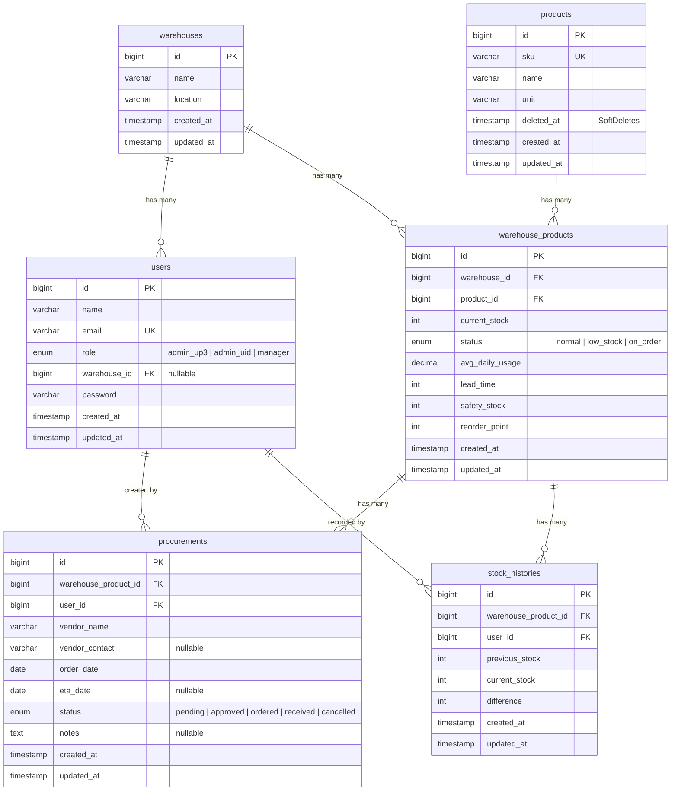

# 📦 StokMonitor — Multi-Warehouse Inventory Monitoring System

Sistem monitoring stok multi-gudang berbasis web untuk mengelola inventaris produk kelistrikan. Dibangun dengan **Laravel 12**, **Livewire**, dan **Tailwind CSS**.

> Proyek ini mensimulasikan sistem manajemen stok untuk PLN (Perusahaan Listrik Negara) dengan 10 gudang UP3 di Sumatera Utara.

---

## ✨ Fitur Utama

| Fitur | Deskripsi |
|---|---|
| **Role-Based Access Control** | 3 role: Admin UID (super admin), Admin UP3 (warehouse admin), Manager |
| **Dashboard Monitoring** | Ringkasan stok seluruh gudang, status per gudang, peringatan stok rendah |
| **Input Stok Harian** | Admin UP3 menginput stok harian untuk gudangnya, otomatis menghitung selisih |
| **Reorder Point (ROP)** | Kalkulasi otomatis ROP, peringatan visual ketika stok di bawah ROP |
| **Pengadaan** | Manager membuat permintaan pengadaan untuk produk stok rendah |
| **Audit Trail** | Setiap perubahan stok tercatat di `stock_histories` |
| **Warehouse Scope** | Admin UP3 otomatis hanya melihat data gudangnya sendiri |

---

## 🛠️ Tech Stack

| Teknologi | Versi |
|---|---|
| PHP | 8.5+ |
| Laravel | 12.x |
| Livewire | 4.x |
| Laravel Breeze | 2.x |
| MySQL | 8.0+ |
| Tailwind CSS | 4.x (via Vite) |
| Node.js | 22.x |

---

## 📋 Prasyarat (Requirements)

Pastikan sudah terinstall:

- **PHP** ≥ 8.2 dengan extensions: `pdo_mysql`, `mbstring`, `openssl`, `tokenizer`, `xml`, `ctype`, `json`
- **Composer** ≥ 2.x
- **MySQL** ≥ 8.0
- **Node.js** ≥ 18.x & npm ≥ 9.x
- **Git**

---

## 🚀 Instalasi & Setup

### 1. Clone Repository

```bash
git clone https://github.com/<username>/sistem-managemen-stok-produk.git
cd sistem-managemen-stok-produk
```

### 2. Install Dependencies

```bash
composer install
npm install
```

### 3. Konfigurasi Environment

```bash
cp .env.example .env
php artisan key:generate
```

Edit file `.env` dan sesuaikan koneksi database:

```env
DB_CONNECTION=mysql
DB_HOST=127.0.0.1
DB_PORT=3306
DB_DATABASE=sistem_managemen_stok_produk
DB_USERNAME=root
DB_PASSWORD=
```

### 4. Setup Database

Buat database MySQL terlebih dahulu:

```sql
CREATE DATABASE sistem_managemen_stok_produk;
```

Jalankan migration dan seeder:

```bash
php artisan migrate
php artisan db:seed
```

### 5. Build Frontend Assets

```bash
npm run build
```

### 6. Jalankan Server

```bash
php artisan serve
```

Akses aplikasi di: **http://127.0.0.1:8000**

---

## 👥 Akun Demo

Seeder membuat 3 akun demo:

| Email | Password | Role | Akses |
|---|---|---|---|
| `admin.uid@test.com` | `password` | Admin UID | Dashboard monitoring seluruh gudang |
| `admin.medan@test.com` | `password` | Admin UP3 | Input stok harian (gudang sendiri) |
| `manager@test.com` | `password` | Manager | Dashboard + form pengadaan |

---

## 🔐 Role & Permissions

### Admin UID (Super Admin)
- ✅ Melihat dashboard monitoring global (seluruh 10 gudang)
- ✅ Melihat summary stok: Normal, Low Stock, On Order
- ✅ Melihat tabel status per gudang
- ✅ Melihat peringatan stok rendah (Top 10)
- ❌ Tidak bisa edit stok
- ❌ Tidak bisa membuat pengadaan

### Admin UP3 (Warehouse Admin)
- ✅ Input stok harian untuk **gudangnya saja** (auto-filtered)
- ✅ Melihat warning stok di bawah ROP (visual merah)
- ✅ Simpan batch perubahan stok
- ✅ Otomatis membuat audit trail (stock_histories)
- ❌ Tidak bisa akses dashboard global
- ❌ Tidak bisa melihat data gudang lain

### Manager
- ✅ Melihat dashboard monitoring global
- ✅ Membuat permintaan pengadaan (`/procurement/{id}`)
- ✅ Input detail vendor, tanggal order, ETA
- ❌ Tidak bisa edit stok harian

---

## 🗄️ Database Schema

### Entity Relationship Diagram



### Penjelasan Relasi

| Relasi | Tipe | Deskripsi |
|---|---|---|
| `warehouses` → `users` | One-to-Many | Satu gudang memiliki banyak user (admin_up3) |
| `warehouses` → `warehouse_products` | One-to-Many | Satu gudang memiliki banyak stok produk |
| `products` → `warehouse_products` | One-to-Many | Satu produk tersebar di banyak gudang |
| `warehouse_products` → `procurements` | One-to-Many | Satu item stok bisa punya banyak pengadaan |
| `warehouse_products` → `stock_histories` | One-to-Many | Satu item stok punya banyak riwayat perubahan |
| `users` → `procurements` | One-to-Many | Satu manager membuat banyak pengadaan |
| `users` → `stock_histories` | One-to-Many | Satu admin UP3 membuat banyak riwayat stok |

---

## 📁 Struktur Proyek

```
sistem-managemen-stok-produk/
├── app/
│   ├── Http/
│   │   ├── Controllers/Auth/          # Authentication controllers (Breeze)
│   │   └── Middleware/
│   │       └── CheckRole.php          # Role-based access middleware
│   ├── Livewire/
│   │   ├── DailyStockInput.php        # Komponen input stok harian
│   │   └── ProcurementForm.php        # Komponen form pengadaan
│   ├── Models/
│   │   ├── Scopes/
│   │   │   └── WarehouseScope.php     # Global scope auto-filter per gudang
│   │   ├── Warehouse.php
│   │   ├── User.php
│   │   ├── Product.php
│   │   ├── WarehouseProduct.php       # Pivot model dengan relasi penuh
│   │   ├── Procurement.php
│   │   └── StockHistory.php
│   └── Services/
│       └── InventoryService.php       # ROP calculation & status checker
├── database/
│   ├── migrations/                    # 6 tabel utama + default Laravel
│   └── seeders/
│       └── DatabaseSeeder.php         # 10 gudang, 50 produk, 3 user, 500 pivot
├── resources/views/
│   ├── dashboard.blade.php            # Dashboard monitoring (admin_uid & manager)
│   ├── layouts/
│   │   ├── app.blade.php              # Layout utama (Breeze)
│   │   └── navigation.blade.php       # Navigasi role-aware
│   └── livewire/
│       ├── daily-stock-input.blade.php # View input stok harian
│       └── procurement-form.blade.php  # View form pengadaan
├── routes/
│   ├── web.php                        # Routing utama + Livewire
│   └── auth.php                       # Auth routes (Breeze)
└── bootstrap/
    └── app.php                        # Middleware alias registration
```

---

## 🧮 Logika Bisnis

### Reorder Point (ROP)

```
ROP = ceil((Avg Daily Usage × Lead Time) + Safety Stock)
```

| Parameter | Deskripsi |
|---|---|
| `avg_daily_usage` | Rata-rata pemakaian harian produk |
| `lead_time` | Waktu tunggu pengiriman (hari) |
| `safety_stock` | Stok cadangan minimum |

### Status Stok

| Status | Kondisi |
|---|---|
| `normal` | `current_stock ≥ ROP` |
| `low_stock` | `current_stock < ROP` dan belum ada pengadaan aktif |
| `on_order` | `current_stock < ROP` dan sudah ada pengadaan aktif (pending/approved/ordered) |

---

## 🔧 Development

### Menjalankan dengan Hot Reload (CSS/JS)

```bash
# Terminal 1: Laravel server
php artisan serve

# Terminal 2: Vite dev server
npm run dev
```

### Fresh Migration + Seed

```bash
php artisan migrate:fresh --seed
```

### PHP Lint Check

```bash
php -l app/Livewire/DailyStockInput.php
php -l app/Livewire/ProcurementForm.php
```

---

## 📊 Data Seeder

Seeder mengisi database dengan data realistis:

| Data | Jumlah | Keterangan |
|---|---|---|
| Gudang | 10 | UP3 di Sumatera Utara (Medan, Binjai, P. Siantar, dll.) |
| Produk | 50 | Peralatan kelistrikan (kabel, trafo, meter, arrester, dll.) |
| User | 3 | 1 Admin UID, 1 Admin UP3, 1 Manager |
| Stok (pivot) | 500 | 50 produk × 10 gudang |
| Distribusi status | 70/20/10 | ~70% normal, ~20% low_stock, ~10% on_order |

---

## 📄 Lisensi

Proyek ini dibuat untuk keperluan magang. Silakan gunakan dan modifikasi sesuai kebutuhan.
