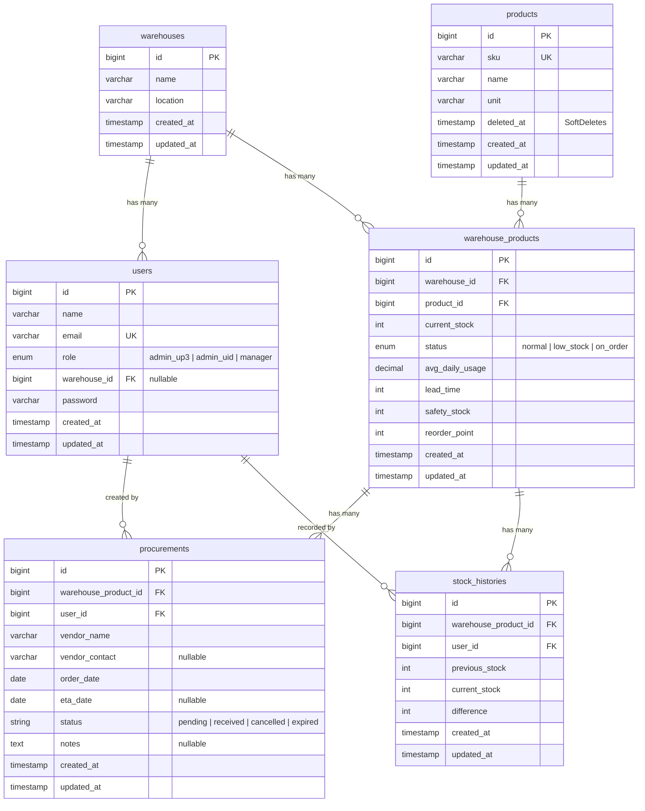

# 📦 StokMonitor — Multi-Warehouse Inventory Monitoring System

Sistem monitoring stok multi-gudang berbasis web untuk mengelola inventaris produk kelistrikan. Dibangun dengan **Laravel 12**, **Livewire**, dan **Tailwind CSS**.

> Proyek ini mensimulasikan sistem manajemen stok untuk PLN (Perusahaan Listrik Negara) dengan 10 gudang UP3 di Sumatera Utara.

---

## ✨ Fitur Utama

| Fitur | Deskripsi |
|---|---|
| **Role-Based Access Control** | 3 role: Admin UID (super admin), Admin UP3 (warehouse admin), Manager |
| **Dashboard Monitoring** | Ringkasan stok seluruh gudang, status per gudang, peringatan stok rendah (paginated) |
| **Input Stok Harian** | Admin UP3 menginput stok harian, otomatis menghitung selisih, indikator "Belum Update" |
| **Reorder Point (ROP)** | Dua mode: **Otomatis** (kalkulasi dari rata-rata harian × lead time + safety stock) atau **Manual** (nilai tetap) |
| **Pengadaan (Procurement)** | Manager membuat permintaan pengadaan + halaman daftar pesanan untuk semua role |
| **Auto-Resolve Status** | Status `on_order` otomatis hilang saat stok naik di atas ROP atau ETA lewat |
| **Notifikasi Email** | Email rangkuman stok rendah otomatis dikirim ke semua manager (terjadwal) |
| **CRUD Management** | Admin UID mengelola produk, gudang, stok gudang, dan user |
| **Audit Trail** | Setiap perubahan stok tercatat di `stock_histories` |
| **Warehouse Scope** | Admin UP3 otomatis hanya melihat data gudangnya sendiri |
| **Pagination** | Semua tabel data menggunakan pagination 10 item/halaman |

---

## 🛠️ Tech Stack

| Teknologi | Versi |
|---|---|
| PHP | 8.5+ |
| Laravel | 12.x |
| Livewire | 4.x |
| Laravel Breeze | 2.x |
| MySQL | 8.0+ |
| Tailwind CSS | 4.x (via Vite) |
| Node.js | 22.x |

---

## 📋 Prasyarat (Requirements)

Pastikan sudah terinstall:

- **PHP** ≥ 8.2 dengan extensions: `pdo_mysql`, `mbstring`, `openssl`, `tokenizer`, `xml`, `ctype`, `json`
- **Composer** ≥ 2.x
- **MySQL** ≥ 8.0
- **Node.js** ≥ 18.x & npm ≥ 9.x
- **Git**

---

## 🚀 Instalasi & Setup

### 1. Clone Repository

```bash
git clone https://github.com/<username>/sistem-managemen-stok-produk.git
cd sistem-managemen-stok-produk
```

### 2. Install Dependencies

```bash
composer install
npm install
```

### 3. Konfigurasi Environment

```bash
cp .env.example .env
php artisan key:generate
```

Edit file `.env` dan sesuaikan koneksi database:

```env
DB_CONNECTION=mysql
DB_HOST=127.0.0.1
DB_PORT=3306
DB_DATABASE=sistem_managemen_stok_produk
DB_USERNAME=root
DB_PASSWORD=
```

### 4. Konfigurasi Email (Opsional)

Untuk mengaktifkan notifikasi email stok rendah, konfigurasi SMTP di `.env`:

```env
MAIL_MAILER=smtp
MAIL_HOST=smtp.gmail.com
MAIL_PORT=587
MAIL_USERNAME=email-pengirim@gmail.com
MAIL_PASSWORD="xxxx xxxx xxxx xxxx"    # Gmail App Password
MAIL_ENCRYPTION=tls
MAIL_FROM_ADDRESS=email-pengirim@gmail.com
MAIL_FROM_NAME="StokMonitor"

STOCK_CHECK_TIME=17:00    # Waktu cek stok harian (WIB, format HH:MM)
```

> **Catatan:** Akun pengirim email **tidak perlu** terdaftar sebagai user di sistem. Email dikirim ke semua user dengan role `manager`.

### 5. Setup Database

Buat database MySQL terlebih dahulu:

```sql
CREATE DATABASE sistem_managemen_stok_produk;
```

Jalankan migration dan seeder:

```bash
php artisan migrate
php artisan db:seed
```

### 6. Build Frontend Assets

```bash
npm run build
```

### 7. Jalankan Server

**Cara 1 — Satu terminal (direkomendasikan):**

```bash
npm run start
```

Perintah ini menjalankan `php artisan serve` dan `php artisan schedule:work` secara bersamaan menggunakan `concurrently`.

**Cara 2 — Dua terminal terpisah:**

```bash
# Terminal 1: Laravel server
php artisan serve

# Terminal 2 (opsional): Scheduler untuk notifikasi email otomatis
php artisan schedule:work
```

Akses aplikasi di: **http://127.0.0.1:8000**

---

## 👥 Akun Demo

Seeder membuat 3 akun demo:

| Email | Password | Role | Akses |
|---|---|---|---|
| `admin.uid@test.com` | `password` | Admin UID | Dashboard + CRUD management semua data |
| `admin.medan@test.com` | `password` | Admin UP3 | Input stok harian (gudang sendiri) |
| `manager@test.com` | `password` | Manager | Dashboard + form pengadaan + daftar pesanan |

---

## 🔐 Role & Permissions

### Admin UID (Super Admin)
- ✅ Melihat dashboard monitoring global (seluruh 10 gudang)
- ✅ Melihat summary stok: Normal, Low Stock, On Order
- ✅ Melihat tabel status per gudang + detail stok per gudang
- ✅ Melihat peringatan stok rendah (paginated, sortir defisit tertinggi)
- ✅ Mengelola data: Produk, Gudang, Stok Gudang, User
- ✅ Melihat daftar pesanan (Pemesanan)
- ✅ Menandai pesanan sebagai diterima / membatalkan pesanan
- ❌ Tidak bisa edit stok harian

### Admin UP3 (Warehouse Admin)
- ✅ Input stok harian untuk **gudangnya saja** (auto-filtered)
- ✅ Melihat warning stok di bawah ROP (visual merah)
- ✅ Melihat indikator **"Belum Update"** untuk item yang belum diupdate hari ini
- ✅ Simpan batch perubahan stok
- ✅ Otomatis membuat audit trail (`stock_histories`)
- ✅ Melihat halaman Kelola Stok (paginated)
- ✅ Melihat daftar pesanan gudangnya (Pemesanan)
- ❌ Tidak bisa akses dashboard global
- ❌ Tidak bisa melihat data gudang lain

### Manager
- ✅ Melihat dashboard monitoring global
- ✅ Melihat detail stok per gudang + indikator "Belum Update"
- ✅ Membuat permintaan pengadaan dari halaman detail gudang (tombol "Order")
- ✅ Input detail vendor, tanggal order, ETA, catatan
- ✅ Melihat daftar pesanan (Pemesanan)
- ✅ Menandai pesanan sebagai diterima / membatalkan pesanan
- ✅ Menerima notifikasi email stok rendah
- ❌ Tidak bisa edit stok harian

---

## 🗄️ Database Schema

### Entity Relationship Diagram


```mermaid
erDiagram
    warehouses {
        bigint id PK
        varchar name
        varchar location
        timestamp created_at
        timestamp updated_at
    }

    users {
        bigint id PK
        varchar name
        varchar email UK
        enum role "admin_up3 | admin_uid | manager"
        bigint warehouse_id FK "nullable"
        varchar password
        timestamp created_at
        timestamp updated_at
    }

    products {
        bigint id PK
        varchar sku UK
        varchar name
        varchar unit
        timestamp deleted_at "SoftDeletes"
        timestamp created_at
        timestamp updated_at
    }

    warehouse_products {
        bigint id PK
        bigint warehouse_id FK
        bigint product_id FK
        int current_stock
        enum status "normal | low_stock | on_order"
        decimal avg_daily_usage
        int lead_time
        int safety_stock
        int reorder_point
        timestamp created_at
        timestamp updated_at
    }

    procurements {
        bigint id PK
        bigint warehouse_product_id FK
        bigint user_id FK
        varchar vendor_name
        varchar vendor_contact "nullable"
        date order_date
        date eta_date "nullable"
        string status "pending | received | cancelled | expired"
        text notes "nullable"
        timestamp created_at
        timestamp updated_at
    }

    stock_histories {
        bigint id PK
        bigint warehouse_product_id FK
        bigint user_id FK
        int previous_stock
        int current_stock
        int difference
        timestamp created_at
        timestamp updated_at
    }

    warehouses ||--o{ users : "has many"
    warehouses ||--o{ warehouse_products : "has many"
    products ||--o{ warehouse_products : "has many"
    warehouse_products ||--o{ procurements : "has many"
    warehouse_products ||--o{ stock_histories : "has many"
    users ||--o{ procurements : "created by"
    users ||--o{ stock_histories : "recorded by"
```

### Penjelasan Relasi

| Relasi | Tipe | Deskripsi |
|---|---|---|
| `warehouses` → `users` | One-to-Many | Satu gudang memiliki banyak user (admin_up3) |
| `warehouses` → `warehouse_products` | One-to-Many | Satu gudang memiliki banyak stok produk |
| `products` → `warehouse_products` | One-to-Many | Satu produk tersebar di banyak gudang |
| `warehouse_products` → `procurements` | One-to-Many | Satu item stok bisa punya banyak pengadaan |
| `warehouse_products` → `stock_histories` | One-to-Many | Satu item stok punya banyak riwayat perubahan |
| `users` → `procurements` | One-to-Many | Satu manager membuat banyak pengadaan |
| `users` → `stock_histories` | One-to-Many | Satu admin UP3 membuat banyak riwayat stok |

---

## 📁 Struktur Proyek

```
sistem-managemen-stok-produk/
├── app/
│   ├── Console/Commands/
│   │   └── CheckLowStock.php          # Command cek stok rendah + auto-resolve ETA expired
│   ├── Http/
│   │   ├── Controllers/Auth/          # Authentication controllers (Breeze)
│   │   └── Middleware/
│   │       └── CheckRole.php          # Role-based access middleware
│   ├── Livewire/
│   │   ├── DailyStockInput.php        # Input stok harian (Admin UP3)
│   │   ├── LowStockTable.php          # Tabel peringatan stok rendah (paginated)
│   │   ├── ManageOrders.php           # Daftar pesanan / pemesanan barang
│   │   ├── ManageProducts.php         # CRUD produk (Admin UID)
│   │   ├── ManageUsers.php            # CRUD user (Admin UID)
│   │   ├── ManageWarehouseProducts.php # Kelola stok gudang (Admin UID/UP3)
│   │   ├── ManageWarehouses.php       # CRUD gudang (Admin UID)
│   │   ├── ProcurementForm.php        # Form pengadaan (Manager)
│   │   └── WarehouseStockDetail.php   # Detail stok per gudang (read-only)
│   ├── Mail/
│   │   └── LowStockAlert.php          # Mailable notifikasi stok rendah
│   ├── Models/
│   │   ├── Scopes/
│   │   │   └── WarehouseScope.php     # Global scope auto-filter per gudang
│   │   ├── Warehouse.php
│   │   ├── User.php
│   │   ├── Product.php
│   │   ├── WarehouseProduct.php       # Pivot model dengan relasi penuh
│   │   ├── Procurement.php
│   │   └── StockHistory.php
│   └── Services/
│       └── InventoryService.php       # ROP calculation & status checker
├── config/
│   └── stockcheck.php                 # Konfigurasi waktu cek stok (STOCK_CHECK_TIME)
├── database/
│   ├── migrations/                    # 6 tabel utama + default Laravel
│   └── seeders/
│       └── DatabaseSeeder.php         # 10 gudang, 50 produk, 3 user, 500 pivot
├── resources/views/
│   ├── dashboard.blade.php            # Dashboard monitoring (Admin UID & Manager)
│   ├── emails/
│   │   └── low-stock-alert.blade.php  # Template email notifikasi stok rendah
│   ├── layouts/
│   │   ├── app.blade.php              # Layout utama (Breeze)
│   │   └── navigation.blade.php       # Navigasi role-aware
│   ├── livewire/
│   │   ├── daily-stock-input.blade.php     # View input stok harian
│   │   ├── low-stock-table.blade.php       # View tabel stok rendah
│   │   ├── manage-orders.blade.php         # View daftar pesanan
│   │   ├── manage-products.blade.php       # View kelola produk
│   │   ├── manage-users.blade.php          # View kelola user
│   │   ├── manage-warehouse-products.blade.php # View kelola stok gudang
│   │   ├── manage-warehouses.blade.php     # View kelola gudang
│   │   ├── procurement-form.blade.php      # View form pengadaan
│   │   └── warehouse-stock-detail.blade.php # View detail stok gudang
│   └── vendor/pagination/
│       └── livewire-light.blade.php        # Custom pagination (light theme)
├── routes/
│   ├── web.php                        # Routing utama + Livewire
│   ├── console.php                    # Scheduler (stock:check-low)
│   └── auth.php                       # Auth routes (Breeze)
└── bootstrap/
    └── app.php                        # Middleware alias registration
```

---

## 🧮 Logika Bisnis

### Reorder Point (ROP)

```
ROP = ceil((Avg Daily Usage × Lead Time) + Safety Stock)
```

| Parameter | Deskripsi |
|---|---|
| `avg_daily_usage` | Rata-rata pemakaian harian produk |
| `lead_time` | Waktu tunggu pengiriman (hari) |
| `safety_stock` | Stok cadangan minimum |

### Status Stok

| Status | Kondisi |
|---|---|
| `normal` | `current_stock > ROP` |
| `low_stock` | `current_stock ≤ ROP` dan belum ada pengadaan aktif |
| `on_order` | Ada pengadaan aktif (pending/approved/ordered) |

### Status Procurement

| Status | Deskripsi |
|---|---|
| `pending` | Pesanan dibuat, menunggu barang datang |
| `received` | Barang diterima (otomatis saat stok > ROP, atau ditandai manual) |
| `cancelled` | Pesanan dibatalkan oleh manager/admin |
| `expired` | ETA sudah lewat tapi stok masih rendah |

### Auto-Resolve Status

- **Saat admin UP3 input stok harian:** Jika stok naik di atas ROP dan ada procurement aktif → procurement otomatis `received`, status item → `normal`
- **Saat scheduler dijalankan (`stock:check-low`):** Jika ETA sudah lewat dan stok masih ≤ ROP → procurement → `expired`, status item → `low_stock`

---

## 🔧 Development

### Menjalankan dengan Hot Reload (CSS/JS)

```bash
# Satu terminal: Server + Scheduler
npm run start

# Terminal tambahan: Vite dev server (hot reload CSS/JS)
npm run dev
```

### Test Notifikasi Email Manual

```bash
php artisan stock:check-low
```

### Fresh Migration + Seed

```bash
php artisan migrate:fresh --seed
```

### PHP Lint Check

```bash
php -l app/Livewire/DailyStockInput.php
php -l app/Livewire/ManageOrders.php
php -l app/Console/Commands/CheckLowStock.php
```

---

## 📊 Data Seeder

Seeder mengisi database dengan data realistis:

| Data | Jumlah | Keterangan |
|---|---|---|
| Gudang | 10 | UP3 di Sumatera Utara (Medan, Binjai, P. Siantar, dll.) |
| Produk | 50 | Peralatan kelistrikan (kabel, trafo, meter, arrester, dll.) |
| User | 3 | 1 Admin UID, 1 Admin UP3, 1 Manager |
| Stok (pivot) | 500 | 50 produk × 10 gudang |
| Distribusi status | 70/20/10 | ~70% normal, ~20% low_stock, ~10% on_order |

---

## 📄 Lisensi

Proyek ini dibuat untuk keperluan magang. Silakan gunakan dan modifikasi sesuai kebutuhan.
